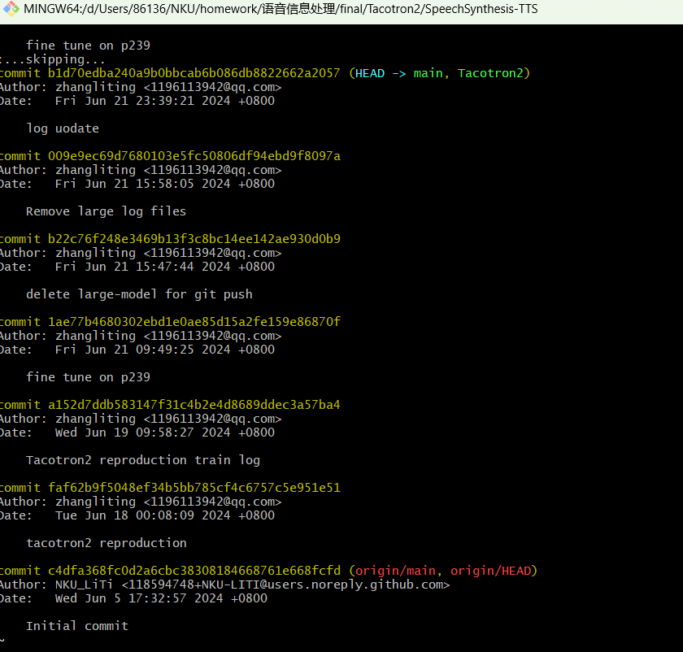

# SpeechSynthesis-TTS
NKU Speech-Information-Processing Final Project

**实验进度安排**

5.25开始查文献和github，主要从两篇TTS综述入手  
6.1确定tacotron2，开始翻译tacotron和tacotron2论文  
6.5开始扣NVIDIA提供的仓库代码，整理self-attention和seq2seq相关基础知识，建仓库，感谢b站up*数学家是我理想* 带着过了代码  
6.15在colab上配完环境训练一天发现算力不够2个epoch，开始使用AutoDL平台  
6.18完成模型复现得到自训练的检查点，开始微调（启发自https://github.com/lturing/tacotronv2_wavernn_chinese.git）  
构思说话人嵌入（启发自https://huggingface.co/learn/audio-course/zh-CN/chapter6/pre-trained_models）

**commit 记录**

初始化仓库后一次commit提交了自训练后的检查点模型，导致缓冲区溢出，后面几次的commit记录无法推送，使用BFG Repo-Cleaner清理了commit的记录中大文件但回退到初始状态，目前仓库的commit记录是新的，下面附上清理之前保存的工作commit记录：

